<div>
  <a href="https://github.com/kAIto47802"></a>
  <div align="right">Last update: 2026/02/07</div>
</div>

<br>

<p>
  &nbsp;&nbsp;&nbsp;&nbsp;&nbsp;For more information, please visit my personal website: <a href="https://kaito47802.github.io">https://kaito47802.github.io</a>.
</p>

<p align="left">
  &nbsp;&nbsp;&nbsp;&nbsp;&nbsp;
  <a href="https://scholar.google.com/citations?user=oJvSC5wAAAAJ">
    <sub></sub>
  </a>
  <a href="https://kaito47802.github.io/cv.pdf">
    <sub></sub>
  </a>
  <a href="https://github.com/kAIto47802">
    <sub></sub>
  </a>
  <span>k.ai.to47802 [at] gmail.com</span>

  ```rust
  let first = "kaito".replace("ai", "AI");
  let last = i32::from_str_radix("baba", 16).unwrap();
  assert_eq!("kAIto47802", format!("{first}{last}"));
  ```
  ```python
  first = "kaito".replace("ai", "AI")
  last = int("baba", 16)
  assert "kAIto47802" == f"{first}{last}"
  ```
  ```typescript
  const first = "kaito".replace("ai", "AI");
  const last = parseInt("baba", 16);
  console.assert("kAIto47802" === `${first}${last}`);
  ```
</p>


<br>

<p>
  <a href="https://github.com/kAIto47802">
    <picture>
      <source media="(max-width:650px)" srcset="assets/repo-small.svg 450w" sizes="12px">
      
    </picture>
  </a>
  <div align="left">
    <a href="https://github.com/sarulab-speech/UTMOSv2">
      <picture>
        <source media="(max-width:650px)" srcset="assets/indent-small.svg 5w" sizes="5px">
        
      </picture>
      <picture>
        <source media="(prefers-color-scheme: light)" srcset="generated/utmosv2-light.svg" sizes="12px">
        
      </picture>
    </a>
  </div>
  <div align="left">
    <a href="https://github.com/kAIto47802/Prover-Agent">
      <picture>
        <source media="(prefers-color-scheme: light)" srcset="generated/prover-agent-light.svg" sizes="12px">
        
      </picture>
    </a>
  </div>
</p>
<p>
  <div align="left">
    <a href="https://github.com/kAIto47802/notist">
      <picture>
        <source media="(max-width:650px)" srcset="assets/indent-small.svg 5w" sizes="5px">
        
      </picture>
      <picture>
        <source media="(prefers-color-scheme: light)" srcset="generated/notist-light.svg" sizes="12px">
        
      </picture>
    </a>
  </div>
</p>

<p>
  <div>
    <a href="https://github.com/kAIto47802">
      <picture>
        <source media="(max-width:650px)" srcset="assets/overview-small.svg 450w" sizes="12px">
        
      </picture>
    </a>
    <p align="left">
      <a href="https://github.com/kAIto47802">
        <picture>
          <source media="(prefers-color-scheme: light) and (max-width:650px)" srcset="assets/li1-small-light.svg 450w" sizes="12px">
          <source media="(prefers-color-scheme: dark) and (max-width:650px)" srcset="assets/li1-small-dark.svg 450w" sizes="12px">
          <source media="(prefers-color-scheme: light)" srcset="assets/li1-large-light.svg 450w" sizes="12px">
          
        </picture>
      </a>
    </p>
  </div>
  <div align="left">
    <a href="https://github.com/kAIto47802">
      <picture>
        <source media="(max-width:650px)" srcset="assets/indent-small.svg 5w" sizes="5px">
        
      </picture>
      <picture>
        
      </picture>
    </a>
  </div>
</p>

<p>
  <a href="https://github.com/kAIto47802">
    <picture>
      <source media="(max-width:650px)" srcset="assets/skills-small.svg 450w" sizes="12px">
      
    </picture>
  </a>
  <a href="https://github.com/kAIto47802">
    <picture>
      <source media="(max-width:650px)" srcset="assets/skill-content-small.svg 550w" sizes="550px">
      
    </picture>
  </a>
  <div align="left">
    <a height="0" href="https://github.com/kAIto47802"></a><a height="0" href="https://github.com/kAIto47802">
      
    </a>
    (Since 2023/06/01)
  </div>
  <!-- <div align="left">
    <font size="0.8">&nbsp;&emsp;&emsp;&emsp;&emsp;&emsp;&emsp;&emsp;&emsp;&emsp;&emsp;&emsp;&emsp;&emsp;&emsp;&emsp;&emsp;&emsp;&emsp;&emsp;&emsp;&emsp;&emsp;&emsp;&emsp;&emsp;&emsp;&emsp;&emsp;&emsp;&emsp;&emsp;(Since 2023/06/01)</font>
  </div> -->
  <div align="left">
    <a href="https://github.com/kAIto47802">
      <picture>
        <source media="(max-width:650px)" srcset="assets/indent-small.svg 5w" sizes="5px">
        
      </picture>
    </a>
    <a href="https://github.com/kAIto47802">
      
    </a>
  </div>
</p>